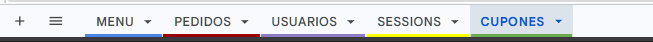
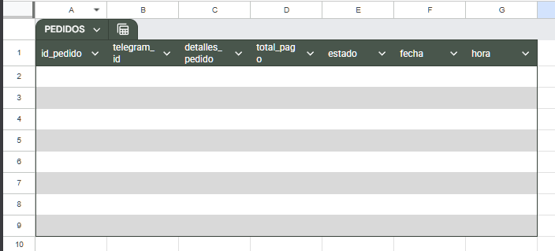
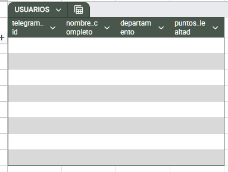
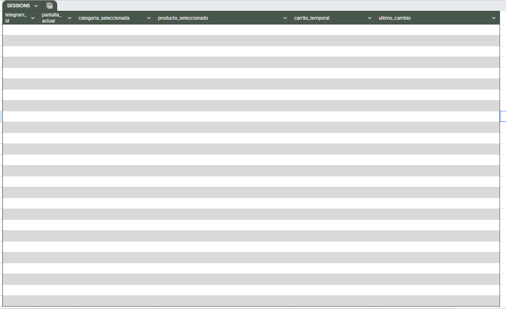
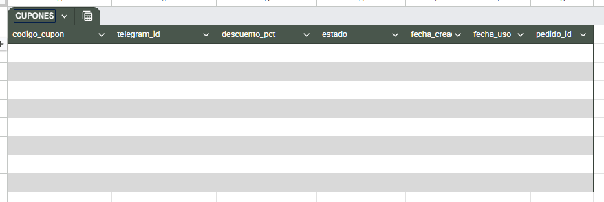

# DeliveryBot — Sistema de Pedidos Automatizado con n8n

> Automatización conversacional de cafetería institucional mediante Telegram, n8n y Google Sheets

---

<div align="center">

| | |
|---|---|
| **Autor** | Diego Mantilla |
| **Curso** | Automatización de Procesos |
| **Plataforma** | n8n self-hosted |
| **Infraestructura** | Docker |
| **Repositorio** | `Proyecto_DeliveryBot_MantillaDiego` |

</div>

---

## Tabla de Contenidos

1. [Explicación del Problema](#explicación-del-problema)
2. [Investigación Realizada](#investigación-realizada)
3. [Tecnologías Utilizadas](#tecnologías-utilizadas)
4. [Requisitos Previos](#requisitos-previos)
5. [Instalación con Docker](#instalación-con-docker)
6. [Modelo de Datos — Google Sheets](#modelo-de-datos--google-sheets)
7. [Arquitectura General del Sistema](#arquitectura-general-del-sistema)
8. [Flujo 1 — Menú y Carrito (Wizard)](#flujo-1--menú-y-carrito-wizard)
9. [Flujo 2 — Procesamiento del Pedido](#flujo-2--procesamiento-del-pedido)
10. [Flujo 3 — Gestión de Estados](#flujo-3--gestión-de-estados)
11. [Flujo 4 — Reporte Diario Automático](#flujo-4--reporte-diario-automático)
12. [Sistema de Puntos y Cupones](#sistema-de-puntos-y-cupones)
13. [Manejo de Errores](#manejo-de-errores)
14. [Evidencias](#evidencias)
15. [Resultados Obtenidos](#resultados-obtenidos)
16. [Conclusiones Finales](#conclusiones-finales)
17. [Estructura del Repositorio](#estructura-del-repositorio)
18. [Referencias](#referencias)

---

## Explicación del Problema

En entornos institucionales como oficinas, universidades o grandes centros de trabajo, la gestión de pedidos de cafetería suele ser ineficiente, provocando filas largas y errores en la toma de pedidos manual. La falta de un sistema digitalizado impide que el personal de cocina organice sus tareas y que los usuarios conozcan el tiempo real de entrega de sus productos.

**DeliveryBot** es una solución de automatización basada en n8n que convierte a Telegram en una terminal de pedidos inteligente. El sistema permite a los empleados o estudiantes:

- Consultar el menú por categorías mediante un flujo guiado por números, sin necesidad de recordar comandos.
- Armar su carrito seleccionando productos numerados y especificando cantidades.
- Recibir notificaciones push en tiempo real sobre el estado del pedido: Recibido → Preparación → En camino → Entregado.
- Consultar el historial de sus últimos 5 pedidos con estado actualizado.
- Acumular puntos de lealtad y canjearlos como cupones de descuento del 10%.

Mientras tanto, el personal de cocina recibe una alerta inmediata de cada nueva orden y el administrador obtiene un reporte diario automático con 6 métricas clave.

### Objetivos del sistema

- Implementar un sistema de pedidos digital mediante una interfaz conversacional guiada (Wizard) en Telegram.
- Automatizar el cálculo de totales con IVA del 19% y la generación de números de orden únicos.
- Gestionar el ciclo de vida del pedido a través de estados dinámicos.
- Centralizar el inventario y menú en Google Sheets para actualización fácil por parte del administrador.
- Validar el stock disponible antes de confirmar cualquier pedido.
- Implementar un sistema de puntos de lealtad con cupones de descuento automáticos.
- Generar reportes diarios de ventas con 6 métricas automáticamente.
- Optimizar la comunicación entre la cocina y el cliente mediante notificaciones push automáticas.

---

## Investigación Realizada

### ¿Qué es n8n y por qué usarlo?

n8n es una plataforma de automatización de flujos de trabajo open-source que permite conectar aplicaciones, APIs y servicios mediante una interfaz visual de nodos. A diferencia de herramientas como Zapier o Make, n8n puede instalarse en servidor propio (self-hosted), garantizando privacidad total de los datos y sin límites de ejecuciones en la versión gratuita.

### ¿Qué es un bot de Telegram y cómo funciona?

Un bot de Telegram es una cuenta automatizada que responde a mensajes enviados por usuarios. Se comunica mediante la **Telegram Bot API**, que expone endpoints REST para enviar y recibir mensajes, botones inline y notificaciones push. En n8n, el nodo `Telegram Trigger` escucha los mensajes entrantes y el nodo `Telegram` los envía.

### ¿Qué es Google Sheets como base de datos?

Google Sheets funciona como una base de datos liviana y accesible visualmente para proyectos de automatización. Su API permite leer, escribir y actualizar filas de forma programática. En este proyecto actúa como capa de persistencia para el menú, pedidos, usuarios, sesiones y cupones.

### ¿Qué es un flujo Wizard (guiado)?

Un flujo Wizard es una experiencia conversacional donde el bot lleva al usuario paso a paso, presentando opciones numeradas en cada etapa y esperando una respuesta numérica. Esto elimina la necesidad de recordar comandos y reduce los errores de entrada. El estado de cada paso se persiste en la hoja SESSIONS mediante el campo `pantalla_actual`.

### ¿Qué es la validación de stock?

La validación de stock verifica que la cantidad solicitada no exceda las unidades disponibles en inventario **antes** de confirmar el pedido. En DeliveryBot esta validación ocurre en dos puntos: al agregar al carrito (nodo `Agregar Producto al Carrito`) y al confirmar (nodo `Validar Stock Carrito`), garantizando consistencia del inventario.

### ¿Qué es el IVA y cómo se aplica?

El IVA (Impuesto al Valor Agregado) del 19% se calcula sobre el subtotal después de aplicar cualquier descuento de cupón. Se muestra desglosado tanto al agregar cada producto al carrito como en la confirmación final del pedido.

### ¿Qué son los puntos de lealtad?

Los puntos de lealtad son un sistema de recompensas donde el usuario acumula **1 punto por cada $1.000 COP gastados** (calculado sobre el total con IVA). Al acumular 100 puntos se genera automáticamente un cupón de descuento del 10% que se aplica en el siguiente pedido.

---

## Tecnologías Utilizadas

<div align="center">

| Tecnología | Rol en el proyecto |
|---|---|
|  | Motor de automatización — 97 nodos en 4 flujos |
|  | Contenedorización y despliegue del entorno n8n |
|  | Interfaz conversacional y canal de notificaciones |
|  | Base de datos: MENU, PEDIDOS, USUARIOS, SESSIONS, CUPONES |
|  | Lógica de negocio en nodos Code |
|  | Formato de comunicación entre nodos y almacenamiento del carrito |

</div>

---

## Requisitos Previos

| Herramienta | Versión Requerida | Versión Instalada | Estado |
|---|---|---|---|
| Docker Desktop | ≥ 24.x | `29.5.2` | ✔ |
| Docker Compose | ≥ 2.x | `5.1.3` | ✔ |
| Cuenta de Telegram | — | Activa | ✔ |
| Cuenta de Google | — | Activa | ✔ |
| Sistema Operativo | Windows 10/11 / macOS / Linux | `Windows` | ✔ |

---

## Instalación con Docker

### Paso 1 — Clonar el repositorio

```bash
git clone https://github.com/DMntill4/Proyecto_DeliveryBot_MantillaDiego.git
cd Proyecto_DeliveryBot_MantillaDiego
```

> 

---

### Paso 2 — Configurar `docker-compose.yml`

**Configuración para desarrollo local** (`N8N_BASIC_AUTH_ACTIVE=false` es aceptable porque solo es accesible desde `localhost`):

```yaml
version: "3.8"

services:
  n8n:
    image: docker.n8n.io/n8nio/n8n
    container_name: n8n_deliverybot
    restart: unless-stopped
    ports:
      - "5678:5678"
    environment:
      - N8N_BASIC_AUTH_ACTIVE=false
      - N8N_ENFORCE_SETTINGS_FILE_PERMISSIONS=true
      - GENERIC_TIMEZONE=America/Bogota
      - TZ=America/Bogota
      - WEBHOOK_URL=https://grouped-omission-scant.ngrok-free.dev/
    volumes:
      - n8n_data:/home/node/.n8n

volumes:
  n8n_data:
```

> 

#### Configuración segura para producción

En un servidor público es **obligatorio** habilitar autenticación:

```yaml
environment:
  - N8N_BASIC_AUTH_ACTIVE=true
  - N8N_BASIC_AUTH_USER=admin_deliverybot
  - N8N_BASIC_AUTH_PASSWORD=ContraseñaSegura2025!
  - N8N_HOST=tudominio.com
  - N8N_PROTOCOL=https
```

---

### Paso 3 — Exposición del servicio mediante NGROK

Para permitir que el sistema n8n sea accesible desde el exterior —facilitando la recepción de eventos desde plataformas como Telegram— se establece un túnel seguro mediante ngrok. Este túnel redirige el tráfico desde una URL pública hacia el puerto 5678 donde opera el contenedor.

```bash
ngrok http 5678
```

> 

---

### Paso 4 — Levantar el contenedor

```bash
docker compose up -d
docker ps
```

> 

---

### Paso 5 — Acceder al dashboard

Abrir `http://localhost:5678`, registrar la cuenta de administrador y acceder al dashboard.

> 

**Comandos de gestión:**

```bash
docker compose up -d            # Levantar
docker ps                       # Ver estado
docker compose down             # Detener
docker logs -f n8n_deliverybot  # Ver logs
```

---

## Modelo de Datos — Google Sheets

El proyecto usa un Google Sheets llamado **DeliveryBot_DB** con 5 hojas:

### Hoja: MENU

| Columna | Tipo | Descripción |
|---|---|---|
| `id_producto` | Texto | Identificador único (ej: `BEB001`) |
| `nombre` | Texto | Nombre del producto |
| `descripcion` | Texto | Descripción breve |
| `precio` | Número | Precio base en COP (sin IVA) |
| `categorias` | Texto | `Bebidas`, `Comida`, `Aperitivos` o `Postres` |
| `stock` | Número | Unidades disponibles |

**Datos de prueba:**

| id_producto | nombre | descripcion | precio | categorias | stock |
|---|---|---|---|---|---|
| BEB001 | Café Americano | Café negro sin azúcar | 3500 | Bebidas | 50 |
| BEB002 | Jugo Hit de Lulo | Botella de jugo Hit sabor a lulo | 3500 | Bebidas | 180 |
| BEB003 | Speed Max | Bebida energizante Speed Max en botella | 3000 | Bebidas | 150 |
| COM001 | Almuerzo del Día | Sopa + seco + jugo | 12000 | Comida | 20 |
| APE001 | Almojábana Costeña | Almojábana artesanal | 2500 | Aperitivos | 40 |

> **Nota:** La columna en Google Sheets es `categorias` (con s), no `categoria`. El nodo `Leer Menú por Categoría` filtra por esta columna exacta.

---

### Hoja: PEDIDOS

| Columna | Tipo | Descripción |
|---|---|---|
| `id_pedido` | Texto | ID único (ej: `PED-1720950000-8900800374`) |
| `telegram_id` | Texto | ID de Telegram del usuario |
| `detalles_pedido` | Texto (JSON) | Array con productos y cantidades |
| `total_pago` | Número | Total final con IVA y descuentos en COP |
| `estado` | Texto | `Recibido`, `Preparación`, `En camino`, `Entregado` |
| `fecha` | Texto | Fecha en formato `DD/MM/YYYY` |
| `hora` | Texto | Hora en formato `HH:MM` |

---

### Hoja: USUARIOS

| Columna | Tipo | Descripción |
|---|---|---|
| `telegram_id` | Texto | ID único de Telegram |
| `nombre_completo` | Texto | Nombre registrado (de `message.from.first_name`) |
| `departamento` | Texto | Valor por defecto: `Sin asignar` |
| `puntos_lealtad` | Número | Puntos acumulados (1 pto por cada $1.000 COP) |

---

### Hoja: SESSIONS

| Columna | Tipo | Descripción |
|---|---|---|
| `telegram_id` | Texto | ID de Telegram del usuario |
| `pantalla_actual` | Texto | Estado del Wizard: `inicio`, `categoria`, `producto`, `carrito` |
| `categoria_seleccionada` | Texto | Categoría activa (ej: `Bebidas`) |
| `producto_seleccionado` | Texto (JSON) | Objeto del producto que espera cantidad |
| `carrito_temporal` | Texto (JSON) | Array con los productos del carrito |
| `ultimo_cambio` | Texto | Timestamp ISO de la última modificación |

> El campo `pantalla_actual` es el corazón del Wizard. El Switch principal lo lee para saber cómo interpretar el número que envía el usuario.

---

### Hoja: CUPONES

| Columna | Tipo | Descripción |
|---|---|---|
| `codigo_cupon` | Texto | Código único (ej: `CUP-8900800374-123456`) |
| `telegram_id` | Texto | Propietario del cupón |
| `descuento_pct` | Número | Porcentaje de descuento (10) |
| `estado` | Texto | `disponible` o `usado` |
| `fecha_creacion` | Texto | Fecha en que se generó |
| `fecha_uso` | Texto | Fecha en que se canjeó |
| `pedido_id` | Texto | ID del pedido en que se usó |

---

<details>
  <summary><b>📊 Google Sheets: Estructura de Base de Datos</b></summary>
  <br>
  <blockquote>

  
  ---
  
  ---
  
  ---
  
  ---
  
  ---
  

  </blockquote>
</details>

---

## Desarrollo del Sistema

### Fase 0 — Configuración de credenciales

Antes de crear los workflows, se configuraron las credenciales en n8n:

#### Crear el bot de Telegram

1. Abrir Telegram → buscar `@BotFather` → `/newbot`.
2. Asignar nombre: `DeliveryBot` y username: `deliverybot_[tuapellido]_bot`.
3. Copiar el **token** que entrega BotFather. Este token se usa en n8n.

> 

#### Configurar credencial Telegram en n8n

1. En n8n ir a **Settings → Credentials → Add Credential → Telegram API**.
2. Pegar el token del bot.
3. Guardar con el nombre `DeliveryBot Telegram`.

> 

#### Configurar credencial Google Sheets en n8n

1. En n8n ir a **Settings → Credentials → Add Credential → Google Sheets OAuth2**.
2. Seguir el flujo de autorización con la cuenta de Google donde está el Sheets.
3. Guardar con el nombre `DeliveryBot Sheets`.

> 

---

## Arquitectura General del Sistema

El sistema está compuesto por **97 nodos** organizados en 4 flujos independientes:

```
┌─────────────────────────────────────────────────────────────────┐
│                    FLUJO 1 — CONVERSACIÓN                        │
│  Telegram Trigger → Verificar Sesión → Switch Principal          │
│    ├── /start         → Registro / Bienvenida                    │
│    ├── mi historial   → Leer PEDIDOS → Mostrar historial + puntos│
│    ├── pantalla=categoria → Selección de producto                │
│    ├── pantalla=producto  → Ingreso de cantidad → Carrito        │
│    ├── ver carrito    → Mostrar carrito con IVA y puntos         │
│    └── confirmar      → [Flujo 2]                                │
├─────────────────────────────────────────────────────────────────┤
│                    FLUJO 2 — PROCESAMIENTO                       │
│  Validar Stock → Procesar Pedido → Guardar PEDIDOS               │
│  → Descontar Stock → Actualizar Puntos → Gestionar Cupón         │
│  → Limpiar Sesión → Notificar Usuario + Cocina                   │
├─────────────────────────────────────────────────────────────────┤
│                    FLUJO 3 — ESTADOS (ADMIN)                     │
│  /estado ID ESTADO → Verificar Admin + Grupo Cocina              │
│  → Validar Estado → Actualizar PEDIDOS → Notificar Cliente       │
├─────────────────────────────────────────────────────────────────┤
│                    FLUJO 4 — REPORTE DIARIO                      │
│  Schedule (11:50 PM) → Leer PEDIDOS del día + MENU               │
│  → Calcular 6 métricas → Enviar reporte al admin                 │
└─────────────────────────────────────────────────────────────────┘
```
### 🔄 Flujo de Trabajo (Demo)

El siguiente GIF ilustra el proceso completo de ejecución: desde la activación del túnel **ngrok** y el estado del contenedor en **Docker**, hasta la interacción exitosa con el **DeliveryBot**.

> 

*Visualización del flujo: Sistema operativo del bot en tiempo real.*


---

## Flujo 1 — Menú y Carrito (Wizard)

### Experiencia del usuario

```
Bot:  ¡Hola! Bienvenido/a a nuestra tienda virtual 🛒✨
      1️⃣ Bebidas  2️⃣ Comida  3️⃣ Aperitivos  4️⃣ Postres

User: 1

Bot:  MENÚ - BEBIDAS
      [ 01 ]  CAFÉ AMERICANO
         └ $3.500 • 50 disp.
      [ 02 ]  JUGO HIT DE LULO
         └ $3.500 • 180 disp.
      0. Regresar al inicio
      Selecciona el número de tu elección:

User: 01

Bot:  Seleccionaste CAFÉ AMERICANO ($3.500)
      ¿Cuántas unidades deseas?

User: 2

Bot:  ✅ 2x Café Americano agregado al carrito
      Subtotal: $7.000 | IVA (19%): $1.330 | TOTAL: $8.330

User: ver carrito

Bot:  🛒 TU CARRITO ACTUAL
       • Café Americano x2 = $7.000 COP
      Subtotal base: $7.000 | IVA: $1.330 | TOTAL: $8.330
      ⭐ Tus puntos: 45 pts — Te faltan 55 pts para un cupón de 10%

User: confirmar  →  [Flujo 2]
```

---

### Nodo 1 — Telegram Trigger

| Parámetro | Valor |
|---|---|
| Credential | DeliveryBot Telegram |
| Updates | `message` |

Escucha todos los mensajes entrantes. Cada mensaje inicia el flujo completo.

---

### Nodo — Verificación de Comando `/estado`

Tras recibir el mensaje, se añade un nodo de tipo **IF** que actúa como filtro condicional para evaluar si el usuario o el cocinero esta intentando usar el comando /estado de actualizacion.

* **Tipo:** IF
* **Condición:** `{{ $('Telegram Trigger').item.json.message.text }}` *starts with* `/estado`

#### Lógica de flujo:
- **Si es `True`:** El flujo se redirige al **Flujo 3** (Gestión de estado del sistema).
- **Si es `False`:** El flujo continúa su ejecución normal hacia los nodos subsiguientes.

---

### Nodo 2 — Leer Sesión Usuario (Google Sheets)

| Parámetro | Valor |
|---|---|
| Operation | Get Row(s) |
| Sheet | SESSIONS (ID: `149368348`) |
| Filter Column | `telegram_id` |
| Filter Value | `{{ $json.message.from.id }}` |

Lee el estado actual del usuario en SESSIONS. Si no existe fila, el resultado llega vacío.

> Este nodo se usa en múltiples flujos. Los nodos Code que lo referencian usan `$('Leer Sesión Usuario').all()` para obtener todas las filas y luego `.find()` para filtrar por `telegram_id`.

---

### Nodo 3 — Verificar Sesión Activa (Code)

**Mode:** Run Once for All Items — **crítico**: evita que el IF reciba múltiples items y dé true y false simultáneamente.

**Qué hace:** Determina si el usuario puede acceder al sistema. Deja pasar siempre `/start` aunque no tenga sesión registrada, permitiendo el flujo de registro sin ciclos viciosos.

```javascript
const trigger = $('Telegram Trigger').item.json;
const telegramId = String(trigger.message?.from?.id ?? "");
const textoUsuario = trigger.message?.text?.trim() ?? "";

// Todas las filas de SESSIONS (puede haber 0 si es usuario nuevo)
const sesiones = $input.all();

// Buscar la sesión del usuario actual
const session = sesiones.find(s =>
  String(s.json.telegram_id ?? "").trim() === telegramId
)?.json;

const estaRegistrado = !!session;
const esStart = textoUsuario === '/start';

// puedeAcceder = true si ya está registrado O si está escribiendo /start
// Esto rompe el ciclo vicioso: /start siempre pasa, sin importar si tiene sesión
const puedeAcceder = estaRegistrado || esStart;

return [{
  json: {
    puedeAcceder,
    textoUsuario,
    telegramId,
    chatId: String(trigger.message?.chat?.id ?? ""),
    // pantalla_actual se pasa al Switch para que pueda enrutar correctamente
    pantalla_actual: session ? session.pantalla_actual : 'inicio'
  }
}];
```

> **Por qué Mode = Run Once for All Items:** Si el Sheets devuelve varias filas (usuario con sesiones duplicadas), el Code en modo "Run Once for Each Item" se ejecutaría una vez por fila, produciendo múltiples items. El IF siguiente los evaluaría uno a uno, generando ramas `true` y `false` simultáneas. Con "Run Once for All Items", el Code siempre devuelve exactamente 1 item.

---

### Nodo 4 — IF Sesion Activa (IF)

| Parámetro | Valor |
|---|---|
| Condition | `{{ $input.first().json.puedeAcceder }}` is true |
| True branch | → Switch Navegación Principal |
| False branch | Limit → Msg Sin Sesión Activa  |

---

### Nodo 5 — Switch Navegación Principal

El enrutador central del sistema. Evalúa en este orden:

| Salida | Condición | Descripción |
|---|---|---|
| 0 | Texto es `/start` | Inicio o reinicio |
| 1 | Texto es `mi_historial`, `mi historial` o `📦 mi historial` | Consultar historial |
| 2 | `pantalla_actual` es `categoria` | Usuario elige producto de la lista |
| 3 | `pantalla_actual` es `producto` | Usuario ingresa cantidad |
| 4 | Texto es `ver_carrito`, `ver carrito` o `🛒 ver carrito` | Ver resumen del carrito |
| 5 | Texto es `confirmar` o `SI` | Confirmar pedido |
| 6 | Texto es `1`, `2`, `3` o `4` | Seleccionar categoría del menú principal |
| Fallback | Cualquier otra cosa | → Msg Error Opción Inválida |

> **Orden crítico:** Las salidas 2 y 3 (basadas en `pantalla_actual`) van **antes** que la salida 6 (basada en el número). Si estuviera al revés, el `1` de "seleccionar producto" siempre caería en "seleccionar categoría".

> 

---

#### Salida 0 — `/start`: Registro y bienvenida

**Cadena de nodos:**

```
Leer Usuarios USUARIOS → IF Usuario Nuevo
  ├── TRUE  → Crear Nuevo Usuario → Crear Nueva Sesión → Msg Bienvenida Nuevo Usuario
  └── FALSE → Actualizar Sesión Start → Msg Bienvenida Start Existente
```

### Nodo 3 — Leer Usuarios (Google Sheets)

Este nodo consulta la base de datos para identificar al usuario que interactúa con el bot, comparando su ID único de Telegram con los registros existentes en la hoja de cálculo.

* **Credencial:** Google Sheets account
* **Recurso:** Sheet Within Document
* **Operación:** Get Row(s)
* **Documento:** DeliveryBot_DB
* **Hoja:** USUARIOS
* **Filtro:** Se utiliza el campo `telegram_id` para buscar coincidencias con el ID del remitente del mensaje recibido en el trigger.

#### Configuración de filtro:
* **Columna:** `telegram_id`
* **Valor:** `{{ $('Telegram Trigger').item.json.message.from.id }}`

**Nodo IF Usuario Nuevo:**

| Parámetro | Valor |
|---|---|
| Condition | `{{ $input.all().length }}` equal to `0` |
| True | → Crear Nuevo Usuario → Crear Nueva Sesión → Msg Bienvenida Nuevo Usuario |
| False | → Actualizar Sesión Start → Msg Bienvenida Start Existente |

**Nodo Crear Nuevo Usuario (Sheets — Append):**

| Campo | Valor |
|---|---|
| Sheet | USUARIOS |
| `telegram_id` | `{{ $('Telegram Trigger').item.json.message.from.id }}` |
| `nombre_completo` | `{{ $('Telegram Trigger').item.json.message.from.first_name }}` |
| `departamento` | `Sin asignar` |
| `puntos_lealtad` | `0` |

**Nodo Actualizar Sesión Start (Sheets — Update):**

| Campo | Valor |
|---|---|
| Operation | Update |
| Sheet | SESSIONS |
| Match Column | `telegram_id` |
| `pantalla_actual` | `inicio` |
| `carrito_temporal` | `[]` |
| `categoria_seleccionada` | *(vacío)* |
| `producto_seleccionado` | *(vacío)* |
| `ultimo_cambio` | `{{ new Date().toISOString() }}` |

**Mensaje de bienvenida (ambas ramas):**
```
¡Hola! Bienvenido/a a nuestra tienda virtual 🛒✨

Estamos listos para ayudarte a encontrar lo más delicioso de nuestro menú.

¿Qué te gustaría ordenar hoy? Selecciona una de nuestras categorías:

1️⃣ 🍹 Bebidas
2️⃣ 🍔 Comida
3️⃣ 🍟 Aperitivos
4️⃣ 🍰 Postres 

👇 ¡Escribe cualquiera de las opciones para ver los productos!
```

> 

---

#### Salida 1 — `mi historial`: Historial + puntos

**Cadena de nodos:**

```
Leer Historial Pedidos → Leer Todos Usuarios → Leer Todos Cupones → IF Sin Pedidos
  ├── TRUE  → Msg Sin Pedidos Aún
  └── FALSE → Construir Historial Pedidos → Msg Historial Pedidos
```

**Nodo — IF Sin Pedidos (Validación)**

Este nodo actúa como una bifurcación lógica para determinar el estado de los pedidos del usuario.

* **Función:** Evalúa si el usuario cuenta con registros de pedidos previos en la base de datos.

**Lógica de flujo:**
* **TRUE:** El flujo se dirige al nodo **Msg Sin Pedidos Aún** (Notifica al usuario que no tiene actividad registrada).
* **FALSE:** El flujo continúa con la secuencia de consulta:
    1. **Construir Historial Pedidos**
    2. **Msg Historial Pedidos** (Presenta el resumen al usuario).

**Nodo Construir Historial Pedidos (Code):**

**Posición en el flujo:** Salida 1 del Switch (historial) → después de `Leer Historial Pedidos`, `Leer Todos Usuarios` y `Leer Todos Cupones`.

**Mode:** Run Once for All Items

**Qué hace:** Construye los últimos 5 pedidos del usuario con estado, productos, total y fecha. Al final agrega la sección completa de fidelización con puntos acumulados y cupones disponibles con sus códigos.

**Nodos de los que lee:**
- `Leer Historial Pedidos` → filas de PEDIDOS filtradas por `telegram_id`
- `Leer Todos Usuarios` → todas las filas de USUARIOS
- `Leer Todos Cupones` → todas las filas de CUPONES

```javascript
const trigger = $('Telegram Trigger').item.json;
const chatId = (trigger.message?.chat?.id || trigger.callback_query?.message?.chat?.id)?.toString() || "";
const telegramId = (trigger.message?.from?.id || trigger.callback_query?.from?.id)?.toString() || "";

const pedidos = $('Leer Historial Pedidos').all();

if (!pedidos || pedidos.length === 0) {
  return [{
    json: {
      chatId,
      mensaje: "📋 No tienes pedidos registrados aún.\nEscribe el número de una categoría para comenzar."
    }
  }];
}

// Tomar los últimos 5 pedidos y mostrarlos del más reciente al más antiguo
const ultimos = pedidos.slice(-5).reverse();

let historial = `📋 *Tus últimos pedidos*\n\n`;

for (const p of ultimos) {
  const emojisEstado = {
    "Recibido": "📬",
    "Preparación": "👨‍🍳",
    "En camino": "🛵",
    "Entregado": "✅"
  };
  const emoji = emojisEstado[p.json.estado] || "📦";

  // Parsear el JSON de detalles_pedido para mostrar productos legibles
  let textoProductos = "";
  if (p.json.detalles_pedido) {
    try {
      const listaProductos = typeof p.json.detalles_pedido === 'string'
        ? JSON.parse(p.json.detalles_pedido)
        : p.json.detalles_pedido;
      textoProductos = listaProductos
        .map(prod => `${prod.qty}x ${prod.nombre}`)
        .join(", ");
    } catch (e) {
      textoProductos = p.json.detalles_pedido;
    }
  } else {
    textoProductos = "Detalle no disponible";
  }

  historial += `*📌 Orden: ${p.json.id_pedido}*\n`;
  historial += `  ${emoji} *Estado:* ${p.json.estado}\n`;
  historial += `  🍵 *Productos:* ${textoProductos}\n`;
  historial += `  💰 *Total:* $${Number(p.json.total_pago).toLocaleString('es-CO')} COP\n`;
  historial += `  📅 *Fecha:* ${p.json.fecha} ${p.json.hora}\n\n`;
  historial += `───────────────────\n\n`;
}

historial += "Para hacer un nuevo pedido escribe el *número de una categoría*.";

// ── Sección de fidelización ──────────────────────────────────────────
const todosUsuarios = $('Leer Todos Usuarios').all();
const usuario = todosUsuarios.find(u => String(u.json.telegram_id).trim() === telegramId)?.json;
const puntosActuales = Number(usuario?.puntos_lealtad) || 0;

const todosCupones = $('Leer Todos Cupones').all();
const cuponesDisp = todosCupones.filter(c =>
  String(c.json.telegram_id).trim() === telegramId &&
  String(c.json.estado).trim() === 'disponible'
);

const PUNTOS_PARA_CUPON = 100;
const puntosParaSiguiente = PUNTOS_PARA_CUPON - (puntosActuales % PUNTOS_PARA_CUPON);

let seccionFidelizacion =
  `\n━━━━━━━━━━━━━━━━━━━━━\n` +
  `⭐ *TUS PUNTOS DE LEALTAD*\n` +
  `🏆 Puntos acumulados: *${puntosActuales} pts*\n`;

if (cuponesDisp.length > 0) {
  seccionFidelizacion += `🎟️ Cupones disponibles: *${cuponesDisp.length}*\n`;
  cuponesDisp.forEach(c => {
    seccionFidelizacion += `   • \`${c.json.codigo_cupon}\` — ${c.json.descuento_pct}% descuento\n`;
  });
} else {
  seccionFidelizacion += `🎯 Próximo cupón en: *${puntosParaSiguiente} pts más*\n`;
}

historial += seccionFidelizacion;

return [{ json: { chatId, mensaje: historial } }];
```

**Output devuelto:**

| Campo | Tipo | Descripción |
|---|---|---|
| `chatId` | String | ID del chat destino |
| `mensaje` | String | Historial formateado con Markdown |

**Ejemplo de salida:**
```
📋 Tus últimos pedidos

📌 Orden: PED-1720950000-8900800374
  📬 Estado: Recibido
  🍵 Productos: 2x Café Americano
  💰 Total: $8.330 COP
  📅 14/07/2025 08:32
───────────────────

━━━━━━━━━━━━━━━━━━━━━
⭐ TUS PUNTOS DE LEALTAD
🏆 Puntos acumulados: 45 pts
🎯 Próximo cupón en: 55 pts más
```

> En caso de no tener pedidos

```
📋 Historial de Pedidos

Aún no has realizado ningún pedido en nuestra tienda virtual.

Recuerda que puedes ganar puntos de lealtad en cada compra que hagas y luego redimirlos como cupones!

En cuanto hagas tu primera compra, aquí podrás ver el resumen detallado de tus platos favoritos, cantidades y estados de envío. ¡Te esperamos! 🛒✨
```

> 
---

#### Salida 6 → Salida 2: Selección de categoría y productos

**Cadena (selección de categoría):**

```
Resolver Categoría → IF Error Categoría
  ├── TRUE  → Msg Error Categoría
  └── FALSE → Normalizar Categoría → Leer Menú por Categoría
              → Construir Menú Categoría → Actualizar Sesión Categoría
              → Msg Menú Categoría
```

**Nodo Resolver Categoría (Code):**

**Posición en el flujo:** Salida 6 del Switch (números 1-4) → primer nodo de la cadena de categorías.

**Mode:** Run Once for All Items

**Qué hace:** Mapea el número enviado por el usuario a su nombre de categoría. Si el número no corresponde a ninguna categoría válida, devuelve `error: true` para que el siguiente IF lo intercepte.

```javascript
const mapa = {
  "1": "Bebidas",
  "2": "Comida",
  "3": "Aperitivos",
  "4": "Postres"
};

const trigger = $('Telegram Trigger').item.json;
const texto = (trigger.callback_query?.data || trigger.message?.text || '').trim();
const chatId = (trigger.message?.chat?.id || trigger.callback_query?.message?.chat?.id)?.toString();

const categoria = mapa[texto];

if (!categoria) {
  return [{
    json: {
      error: true,
      chatId,
      mensaje: "⚠️ *Opción no válida.*\n\nPor favor, elige una categoría escribiendo su número:\n\n" +
               "1️⃣ Bebidas\n2️⃣ Comida\n3️⃣ Aperativos\n4️⃣ Postres"
    }
  }];
}

return [{ json: { categoria, chatId, error: false } }];
```

**Output devuelto:**

| Campo | Tipo | Descripción |
|---|---|---|
| `categoria` | String | Nombre exacto de la categoría (`Bebidas`, `Comida`, `Aperitivos`, `Postres`) |
| `chatId` | String | ID del chat |
| `error` | Boolean | `true` si el número no es válido |

> **Nota técnica:** El valor `categoria` que devuelve este nodo pasa por el nodo `Normalizar Categoría` (tipo Set) antes de llegar al filtro del Sheets. Esto limpia espacios y normaliza el texto antes de usarlo como filtro en la columna `categorias` del MENU.

**Nodo IF Error Categoría:**

| Parámetro | Valor |
|---|---|
| Condition | `{{ $json.error }}` equal to `true` |
| True | → Msg Error Categoría |
| False | → Leer Menú por Categoría → Construir Menu Categoria → Actualizar Session Categoria → Msg Menu Categoria|

**Nodo Normalizar Categoría (Set):**

**Posición:** Entre `Resolver Categoría` y `Leer Menú por Categoría`. Limpia el texto de la categoría antes de usarlo como filtro en el Sheets, eliminando espacios y normalizando el formato.

| Campo | Expresión |
|---|---|
| `categoria_limpia` | `{{ $json.categoria.trim() }}` |

**Nodo Leer Menú por Categoría (Sheets):**

| Parámetro | Valor |
|---|---|
| Filter Column | `categorias` |
| Filter Value | `{{ $('Normalizar Categoría').item.json.categoria_limpia.trim() }}` |

**Nodo Construir Menú Categoría (Code):**

**Posición en el flujo:** Después de `Leer Menú por Categoría`.

**Mode:** Run Once for All Items

**Qué hace:** Filtra solo los productos con stock > 0, construye el mensaje numerado con formato visual y genera el array de productos que se guarda en SESSIONS para que el siguiente paso pueda identificar el producto elegido por número.

**Nodos de los que lee:**
- `$input.all()` → productos de la categoría (output de `Leer Menú por Categoría`)
- `$('Leer Sesión Usuario').item.json.categoria` → nombre de la categoría actual

```javascript
const trigger = $('Telegram Trigger').item.json;
const chatId = (trigger.message?.chat?.id || trigger.callback_query?.message?.chat?.id)?.toString();

// El nombre de la categoría viene de la sesión guardada
const categoria = $('Leer Sesión Usuario').item.json.categoria || 'Catálogo';

// Solo mostrar productos con stock disponible
const productosDisponibles = $input.all().filter(i => Number(i.json.stock) > 0);

const formatoCOP = (precio) =>
  new Intl.NumberFormat('es-CO', { style: 'currency', currency: 'COP', minimumFractionDigits: 0 }).format(precio);

// Sin stock disponible
if (productosDisponibles.length === 0) {
  return [{ json: {
    chatId,
    mensaje: `❄️ *${categoria.toUpperCase()}*\n\nPor ahora no tenemos disponibilidad.`,
    categoria,
    productos: []
  }}];
}

let mensaje = `  *M E N Ú  -  ${categoria.toUpperCase()}*\n`;
mensaje += `──────────────────────\n\n`;

// Construir lista numerada y array de productos simultáneamente
const listaProductos = productosDisponibles.map((item, idx) => {
  const num = idx + 1;
  const prod = item.json;

  // Número con padding de 2 dígitos para alineación visual: [ 01 ], [ 02 ]...
  mensaje += `\`[ ${num.toString().padStart(2, '0')} ]\`  *${prod.nombre.toUpperCase()}*\n`;
  mensaje += `   └ 💸 ${formatoCOP(prod.precio)}  •  📦 ${prod.stock} disp.\n`;
  mensaje += `   └ 📝 _${prod.descripcion}_\n\n`;

  // Array que se guarda en SESSIONS.producto_seleccionado
  return {
    numero: num,
    id: prod.id_producto,
    nombre: prod.nombre,
    precio: prod.precio,
    stock: prod.stock
  };
});

mensaje += `──────────────────────\n`;
mensaje += ` *0.* Regresar al inicio\n\n`;
mensaje += `👉 *Selecciona el número de tu elección:*`;

return [{
  json: {
    chatId,
    mensaje,
    categoria,
    // Se guarda como JSON string en SESSIONS para recuperarlo en el siguiente paso
    productos: JSON.stringify(listaProductos)
  }
}];
```

**Output devuelto:**

| Campo | Tipo | Descripción |
|---|---|---|
| `chatId` | String | ID del chat |
| `mensaje` | String | Lista numerada formateada |
| `categoria` | String | Nombre de la categoría mostrada |
| `productos` | String (JSON) | Array serializado — se guarda en SESSIONS.producto_seleccionado |

> **Por qué se guarda `productos` en SESSIONS:** Cuando el usuario responde con el número `2`, el bot necesita saber a qué producto corresponde ese `2` dentro de la lista que mostró. Como el bot es stateless, la lista se persiste en SESSIONS para cruzarla en el siguiente paso.

**Nodo Actualizar Sesión Categoría (Sheets — Update):**

| Parámetro | Valor |
|---|---|
| Operation | Update |
| Sheet | SESSIONS |
| Match Column | `telegram_id` |
| `pantalla_actual` | `categoria` |
| `categoria_seleccionada` | `{{ $('Construir Menú Categoría').item.json.categoria }}` |
| `producto_seleccionado` | `{{ $('Construir Menú Categoría').item.json.productos }}` |
| `ultimo_cambio` | `{{ new Date().toISOString() }}` |

**Ejemplo de mensaje generado:**
```
  M E N Ú  -  BEBIDAS
──────────────────────

[ 01 ]  CAFÉ AMERICANO
   └ $3.500  •  📦 50 disp.
   └ Café negro sin azúcar

[ 02 ]  JUGO HIT DE LULO
   └ $3.500  •  📦 180 disp.
   └ Botella de jugo Hit sabor a lulo

──────────────────────
 0. Regresar al inicio

👉 Selecciona el número de tu elección:
```

> 

---

