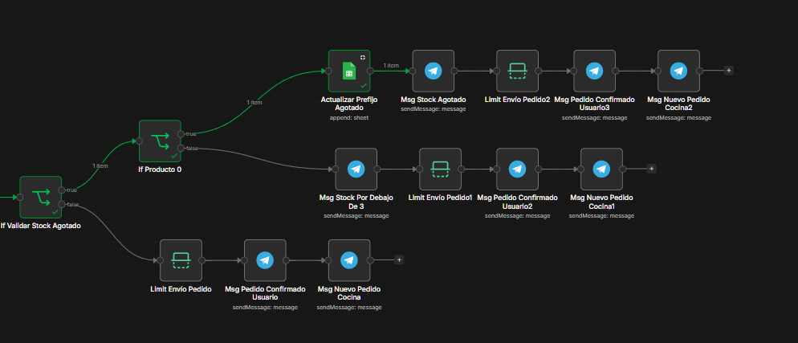

# Flujos n8n - Actualizacion

## Funcionalidad de stock

Se agrego nueva funcionalidad automatica para el admin. Consiste en notificar automaticamente al grupo de REPORTES cuando un producto se quedo en stock critico (3 o menos),
O si producto se quedo sin stock, se le notifica al usuario.

> 