# Evidencias — DeliveryBot

Registro visual de capturas, demo en video y logs del sistema.

---

## Índice maestro de capturas

| # | Archivo | Categoría | Descripción |
|---|---|---|---|
| — | `10-flujo-demo.gif` | 🎬 Demo | Recorrido completo del flujo conversacional en Telegram |
| 01 | `01-clone-repo.png` | Infraestructura | Clonación del repositorio desde GitHub |
| 02 | `02-docker-compose.png` | Infraestructura | Archivo `docker-compose.yml` configurado |
| 03 | `03-ngrok.png` | Infraestructura | Túnel ngrok activo con URL pública |
| 04 | `04-docker-ps.png` | Infraestructura | Contenedor `n8n_deliverybot` corriendo (`docker ps`) |
| 05 | `05-dashboard-n8n.png` | n8n | Dashboard principal con los 4 flujos importados |
| 06 | `06.1-google-sheets.png` | Base de datos | Hoja **MENU** con productos y stock |
| 06.1 | `06.2-google-sheets.png` | Base de datos | Hoja **PEDIDOS** con registros de órdenes |
| 06.2 | `06.3-google-sheets.png` | Base de datos | Hoja **USUARIOS** con puntos de fidelización |
| 06.3 | `06.4-google-sheets.png` | Base de datos | Hoja **SESSIONS** con estado del wizard por usuario |
| 06.4 | `06.5-google-sheets.png` | Base de datos | Hoja **CUPONES** con códigos y estados |
| 06.5 | `06-google-sheets.png` | Base de datos | Vista general del Spreadsheet `DeliveryBot_DB` |
| 07 | `07-botfather-token.png` | Configuración | Creación del bot en `@BotFather` y token generado |
| 08 | `08-credencial-telegram.png` | Configuración | Credencial Telegram API configurada en n8n |
| 09 | `09-credencial-sheets.png` | Configuración | Credencial Google Sheets OAuth2 configurada en n8n |
| 10 | `10-flujo-demo.gif` | Flujo 1 | Demo del flujo conversacional completo (ver sección Demo) |
| 11 | `11-primer-flujo.png` | Flujo 1 | Canvas completo del Flujo 1 — Menú y Carrito (97 nodos) |
| 12 | `12-usuarios-flujo.png` | Flujo 1 | Sub-rama de registro y bienvenida de usuarios |
| 13 | `13-historial-flujo.png` | Flujo 1 | Sub-rama de historial de pedidos y puntos |
| 14 | `14-categoria-flujo.png` | Flujo 1 | Sub-rama de selección de categoría y menú |
| 15 | `15-seleccion-flujo.png` | Flujo 2 | Canvas del Flujo 2 — Procesamiento del pedido |
| 16 | `16-seleccion-carrito.png` | Flujo 1 | Sub-rama de agregar al carrito y vista del carrito |
| 17 | `17-ver-carrito.png` | Flujo 1 | Vista del carrito en Telegram con IVA y descuentos |
| 18 | `18-confirmacion-flujo.png` | Flujo 2 | Ejecución exitosa del Flujo 2 en n8n (nodos en verde) |
| 19 | `19-admin-flujo.png` | Flujo 3 | Canvas del Flujo 3 — Gestión de estados (admin) |
| 20 | `20-reporte-diario.png` | Flujo 4 | Reporte diario generado y enviado al admin |
| 20 | `21-flujo-completo.png` | Flujo Total | Vista general de la arquitectura en N8N |

---

## 🎬 Demo — Flujo conversacional completo

> 

Recorrido de extremo a extremo:

| Paso | Acción |
|---|---|
| 1 | Usuario envía `/start` → bot registra y muestra menú principal |
| 2 | Selección de categoría (`1` → Bebidas) |
| 3 | Selección de producto (número del menú) |
| 4 | Ingreso de cantidad |
| 5 | `ver carrito` → resumen con IVA calculado |
| 6 | `confirmar` → confirmación + notificación a cocina |

---

## Sección 1 — Infraestructura y configuración

### 1.1 — Clonar repositorio

> 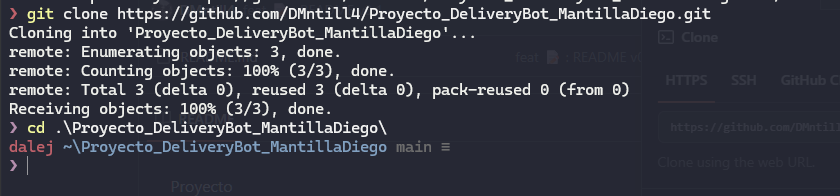

```bash
git clone https://github.com/DMntill4/Proyecto_DeliveryBot_MantillaDiego.git
cd Proyecto_DeliveryBot_MantillaDiego
```

---

### 1.2 — Docker Compose

> 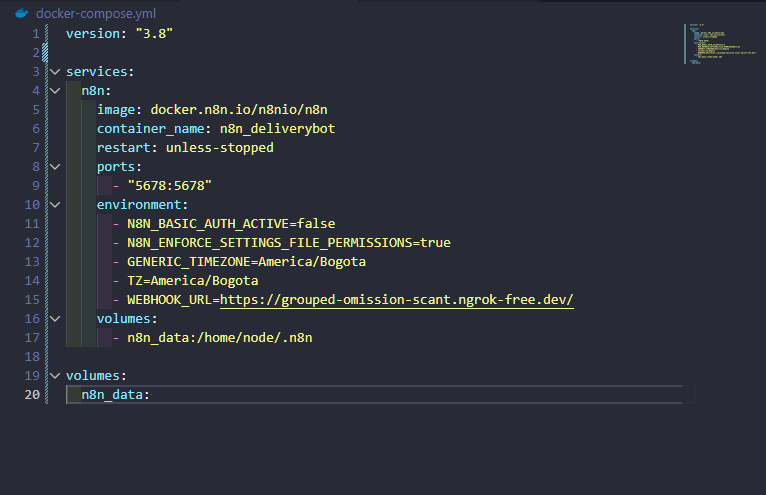

Muestra el archivo `docker-compose.yml` con:
- `WEBHOOK_URL` apuntando a la URL de ngrok
- `GENERIC_TIMEZONE=America/Bogota`
- Volumen `n8n_data` persistente

---

### 1.3 — ngrok activo

> 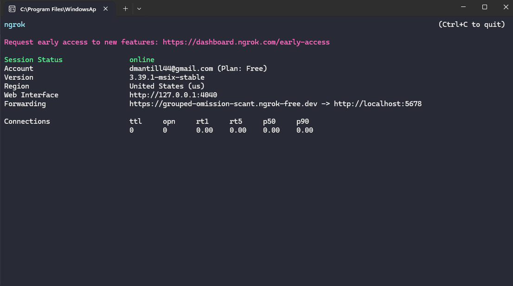

```
Session Status: online
Forwarding: https://grouped-omission-scant.ngrok-free.dev -> http://localhost:5678
```

> La URL de ngrok debe coincidir exactamente con `WEBHOOK_URL` en el `docker-compose.yml`.

---

### 1.4 — Contenedor corriendo

> 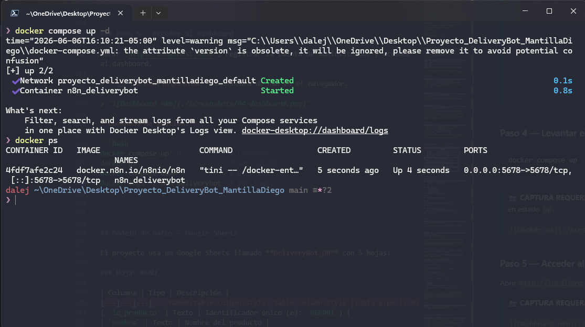

```
CONTAINER ID   NAME               STATUS       PORTS
a1b2c3d4e5f6   n8n_deliverybot    Up 2 hours   0.0.0.0:5678->5678/tcp
```

---

### 1.5 — Dashboard n8n

> 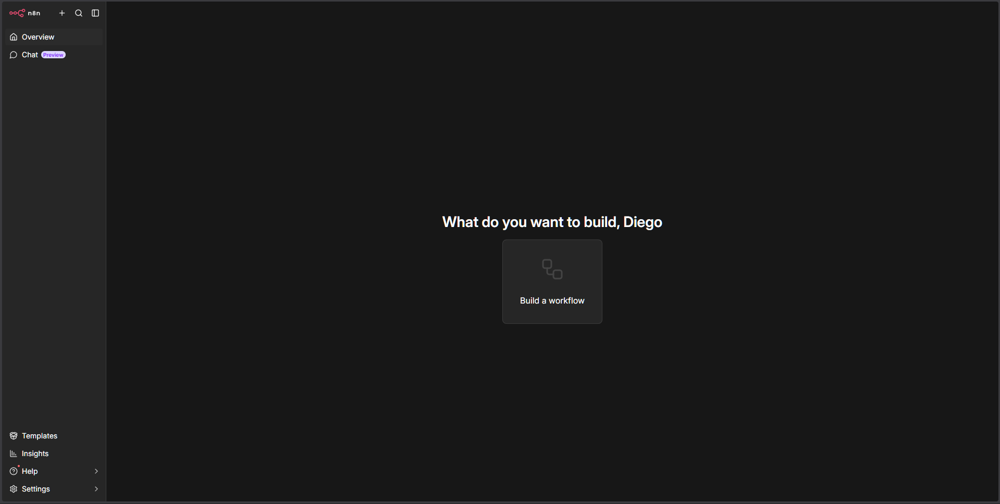

Panel principal de n8n.

---

### 1.6 — Google Sheets (base de datos)

> 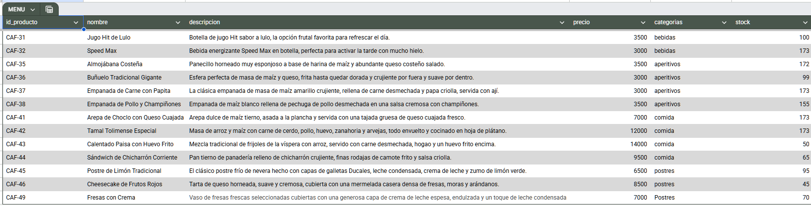

| Captura | Hoja | Contenido visible |
|---|---|---|
| [06.1-google-sheets.png](../screenshots/06.1-google-sheets.png) | MENU | Columnas: `id_producto`, `nombre`, `precio`, `categorias`, `stock` |
| [06.2-google-sheets.png](../screenshots/06.2-google-sheets.png) | PEDIDOS | Columnas: `id_pedido`, `estado`, `total_pago`, `detalles_pedido` |
| [06.3-google-sheets.png](../screenshots/06.3-google-sheets.png) | USUARIOS | Columnas: `telegram_id`, `nombre_completo`, `puntos_lealtad` |
| [06.4-google-sheets.png](../screenshots/06.4-google-sheets.png) | SESSIONS | Columnas: `pantalla_actual`, `carrito_temporal`, `producto_seleccionado` |
| [06.5-google-sheets.png](../screenshots/06.5-google-sheets.png) | CUPONES | Columnas: `codigo_cupon`, `estado`, `descuento_pct`, `pedido_id` |

---

### 1.7 — Credenciales

**BotFather — generación del token:**
> 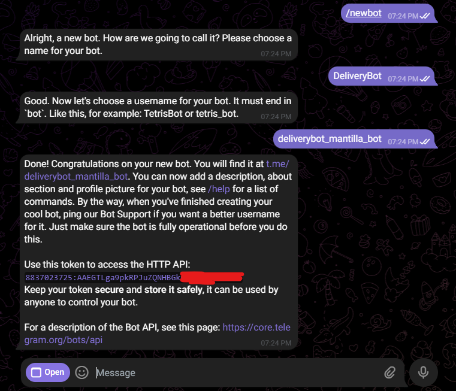

```
Done! Congratulations on your new bot.
Use this token to access the HTTP API:
7XXXXXXXXX:AAXXXXXXXXXXXXXXXXXXXXXXXXXXXXXXXXXXXXXXX
```

**Credencial Telegram en n8n:**
> 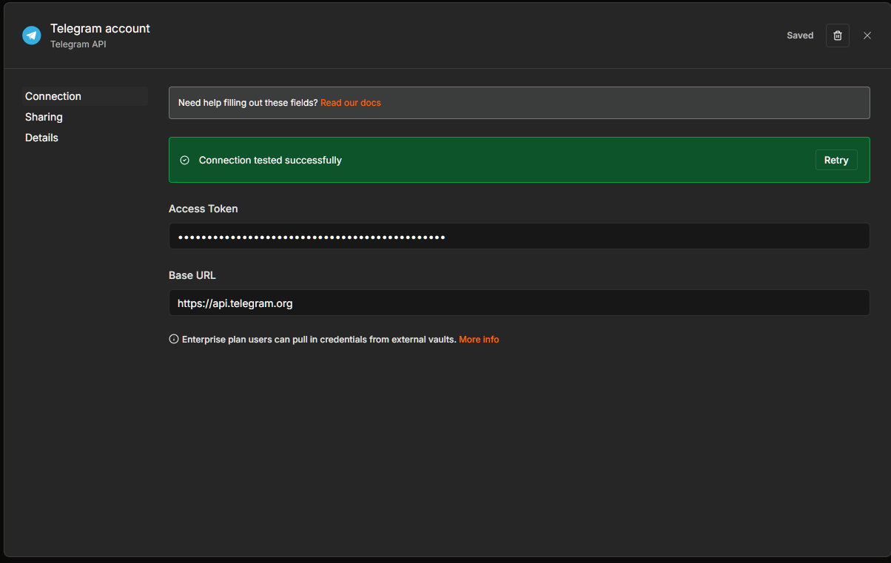

Muestra campo `Access Token` completado, estado `✅ Connection tested successfully`.

**Credencial Google Sheets en n8n:**
> 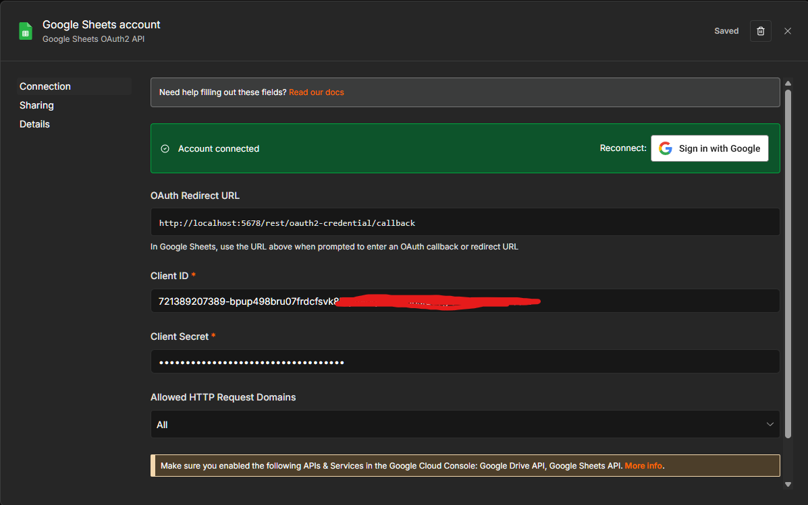

OAuth2 completado con la cuenta del Spreadsheet, estado `✅ Connection tested successfully`.

---

## Sección 2 — Flujo 1: Menú y Carrito

### 2.1 — Canvas completo

> 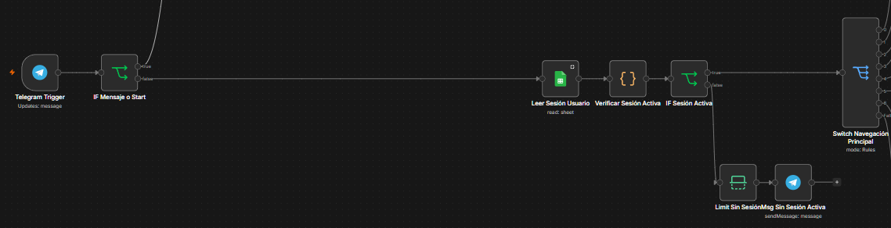

Vista del canvas completo del Flujo 1. Puntos de referencia visual:

| Zona del canvas | Nodos visibles |
|---|---|
| Izquierda | Telegram Trigger → IFs iniciales → Switch Principal |
| Centro-arriba | Rama `/start` (registro y bienvenida) |
| Centro | Rama historial y rama categorías |
| Centro-abajo | Rama carrito y rama confirmar |
| Derecha | Nodos de mensajes Telegram de respuesta |

---

### 2.2 — Sub-ramas documentadas

**Registro / Bienvenida** — `Leer Usuarios → IF Usuario Nuevo → Crear Nuevo Usuario → Crear Nueva Sesión`

> 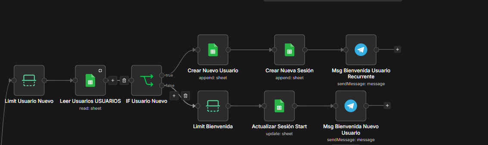

---

**Historial + Puntos** — `Leer Historial Pedidos → Construir Historial Pedidos → Msg Historial`

> 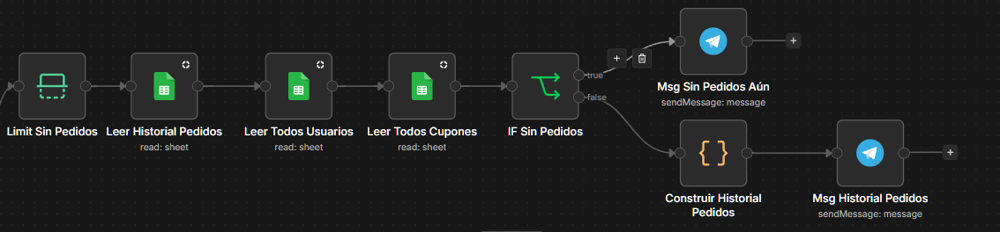

---

**Selección de Categoría** — `Resolver Categoría → Leer Menú por Categoría → Construir Menú → Actualizar Sesión`

> 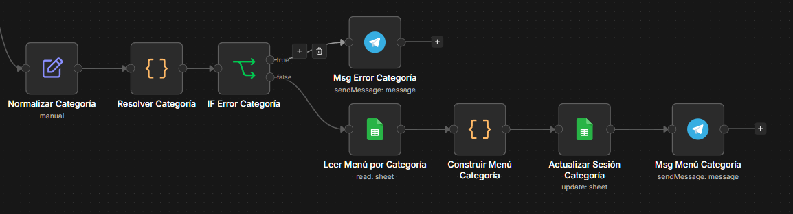

---

**Agregar al Carrito** — `Agregar Producto al Carrito → Guardar Carrito en Sesión → Msg Producto Agregado`

> 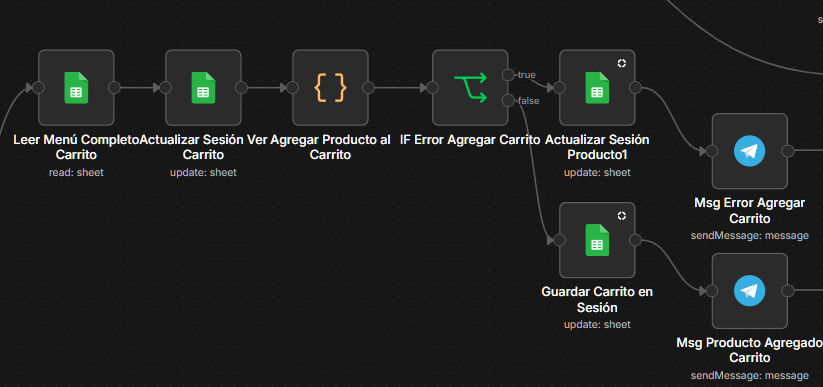

---

**Vista del Carrito** — `Leer Sesión → Construir Vista Carrito → Msg Vista Carrito`

> 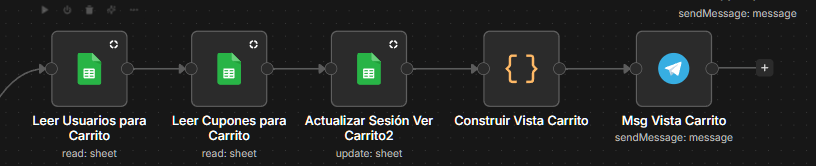

---

## Sección 3 — Flujo 2: Procesamiento del Pedido

### 3.1 — Canvas del Flujo 2

> 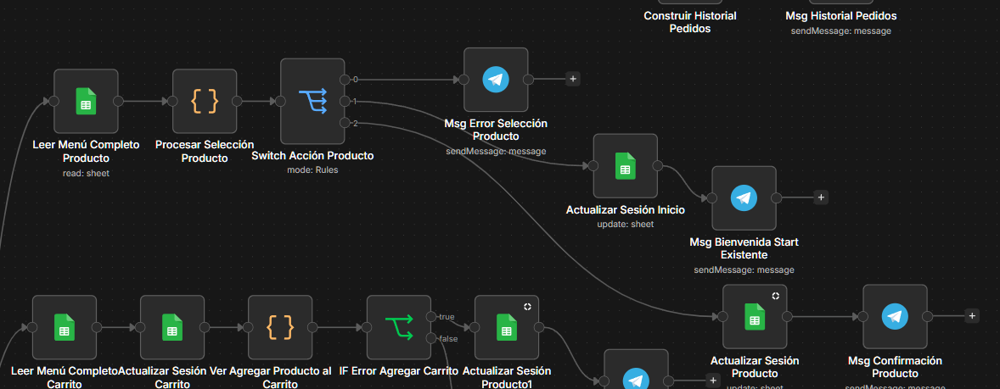

---

### 3.2 — Canvas flujo de confirmacion de pedido

> 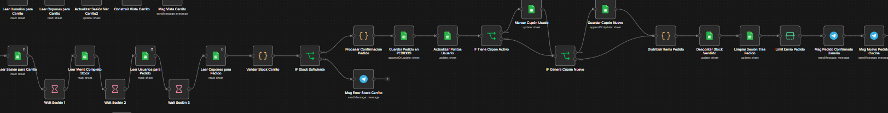

Vista general del flujo de confirmacion de pedido. Se hacen validaciones y confirmaciones de session y cupones para una mejor experiencia de usuario.

- Datos de entrada/salida en el nodo `Procesar Confirmación Pedido`
- `idPedido`, `totalFinal`, `puntosNuevos` correctamente calculados
- Nodos `IF Tiene Cupón Activo` e `IF Genera Cupón Nuevo` con rama TRUE/FALSE visible

---

## Sección 4 — Flujo 3: Gestión de Pedidos

### 4.1 — Canvas del Flujo 3

> 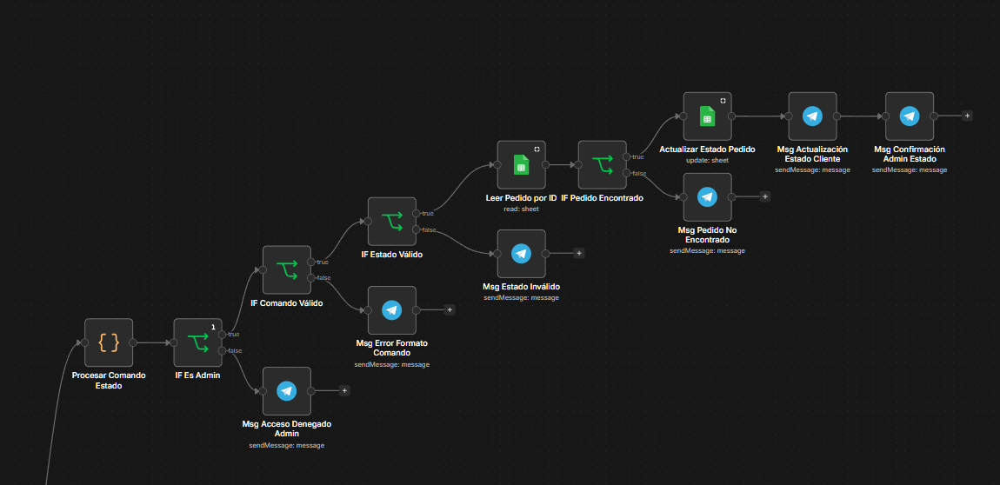

Estructura de validaciones en cascada visible:

```
Procesar Comando Estado
→ IF Es Admin → IF Comando Válido → IF Estado Válido
→ Leer Pedido por ID → IF Pedido Encontrado
→ Actualizar Estado Pedido
→ Msg Estado Cliente + Msg Confirmación Admin
```

Cada rama FALSE conecta a su mensaje de error correspondiente.

---

## Sección 5 — Flujo 4: Reporte Diario

### 5.1 — Reporte recibido por el admin

> 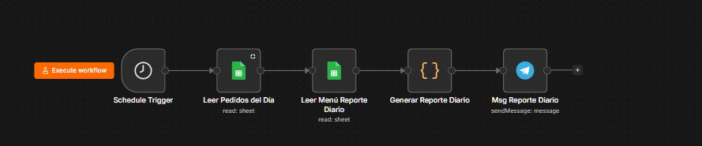

Muestra el mensaje recibido en el chat del admin con las 6 métricas:

```
📊 Reporte diario — DD/MM/YYYY
━━━━━━━━━━━━━━━━━━━━━━
📦 Total de pedidos:    N
💰 Total vendido:       $XXX.XXX COP
🧾 Ticket promedio:     $XX.XXX COP
⭐ Producto estrella:   [Nombre] (N uds.)
🕐 Hora pico:           HH:00 (N pedidos)
👥 Usuarios únicos:     N
━━━━━━━━━━━━━━━━━━━━━━
🤖 Generado automáticamente por DeliveryBot
```

---

## Sección 6 — Flujo completo: vista de ejecución en n8n

Diagrama completo de la arquitectura del sistema, mostrando la secuencia lógica de nodos y la integración entre servicios.

> 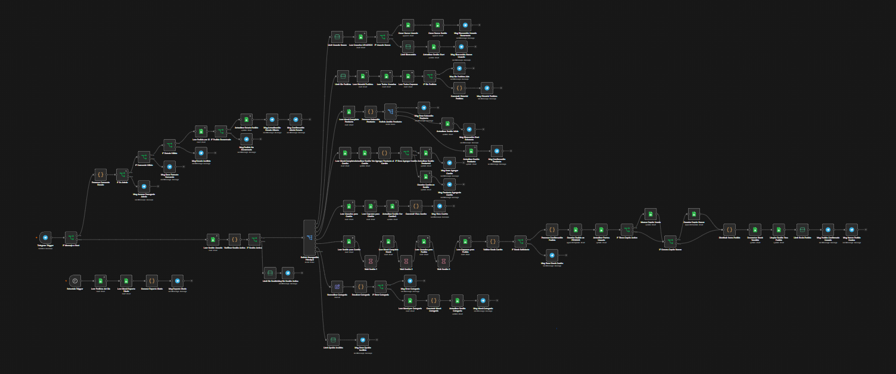

| Color del nodo | Significado |
|---|---|
| 🟢 Verde | Ejecutado sin errores |
| 🔴 Rojo | Error — revisar entrada/salida del nodo |
| ⚪ Gris | No ejecutado en esta rama (rama alternativa del Switch/IF) |
| 🟡 Amarillo | En espera (nodo Wait activo) |

---

### 6.1 — Flujo 1: ramas activas por caso

| Caso de uso | Rama activa | Nodos en verde esperados |
|---|---|---|
| `/start` nuevo | Salida 0 del Switch | Leer Usuarios → Crear Usuario → Crear Sesión → Msg Bienvenida |
| Selección categoría | Salida 6 → 2 | Resolver Categoría → Leer Menú → Construir Menú → Actualizar Sesión |
| Agregar producto | Salida 3 | Agregar Producto al Carrito → Guardar Carrito → Msg Agregado |
| Ver carrito | Salida 4 | Leer Sesión → Construir Vista Carrito → Msg Carrito |
| Confirmar | Salida 5 | → Flujo 2 completo |
| Manejo de Errores | Salida FallBack |

---

## Sección 7 — Tabla de resultados por caso de prueba

Registro consolidado de ejecuciones realizadas.

| CP | Descripción | Resultado | Observaciones |
|---|---|---|---|
| CP-01 | Registro usuario nuevo | ⬜ Pendiente | |
| CP-02 | Registro usuario existente | ⬜ Pendiente | |
| CP-03 | Pedido completo sin cupón | ⬜ Pendiente | |
| CP-04 | Pedido con cupón aplicado | ⬜ Pendiente | |
| CP-05 | Generación automática de cupón | ⬜ Pendiente | |
| CP-06 | Stock insuficiente al agregar | ⬜ Pendiente | |
| CP-07 | Stock agotado entre carrito y confirmación | ⬜ Pendiente | |
| CP-08 | Inputs inválidos en el wizard | ⬜ Pendiente | |
| CP-09 | Historial de pedidos y puntos | ⬜ Pendiente | |
| CP-10 | Cambio de estado por admin | ⬜ Pendiente | |
| CP-11 | Validaciones de seguridad Flujo 3 | ⬜ Pendiente | |
| CP-12 | Reporte diario automático | ⬜ Pendiente | |
| CP-13 | Concurrencia básica | ⬜ Pendiente | |

---

## Log de ejecuciones n8n

### Cómo acceder

1. n8n → Flujo abierto → panel lateral `Executions`.
2. Filtrar por fecha y estado (`Success` / `Error`).
3. Clic en una ejecución → ver entrada/salida de cada nodo.

### Estados

| Estado | Significado |
|---|---|
| ✅ Success | Todos los nodos completaron sin error |
| ❌ Error | Algún nodo lanzó excepción — nodo marcado en rojo |
| ⚠️ Waiting | Nodo Wait activo |

### Errores frecuentes

| Error | Causa | Solución |
|---|---|---|
| `Cannot read property 'from' of undefined` | Update no es `message` | Verificar filtro `message` en Telegram Trigger |
| `Sheets: No rows found` | Usuario sin fila en SESSIONS | Enviar `/start` primero |
| `Cannot read property '0' of undefined` | Nodo Code espera item pero viene vacío | Revisar nodo Sheets anterior |
| `401 Unauthorized` (Telegram) | Token expirado | Regenerar en `@BotFather` → actualizar credencial |
| `403 Forbidden` (Google) | OAuth vencido | Re-autenticar credencial Google Sheets en n8n |

---